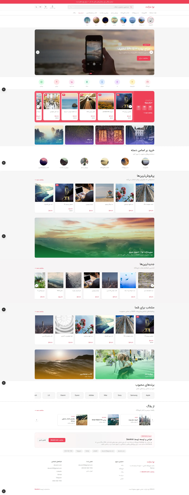
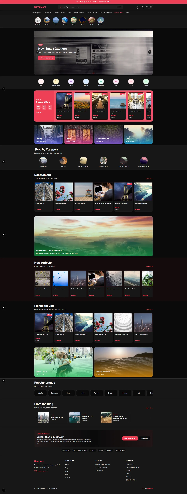
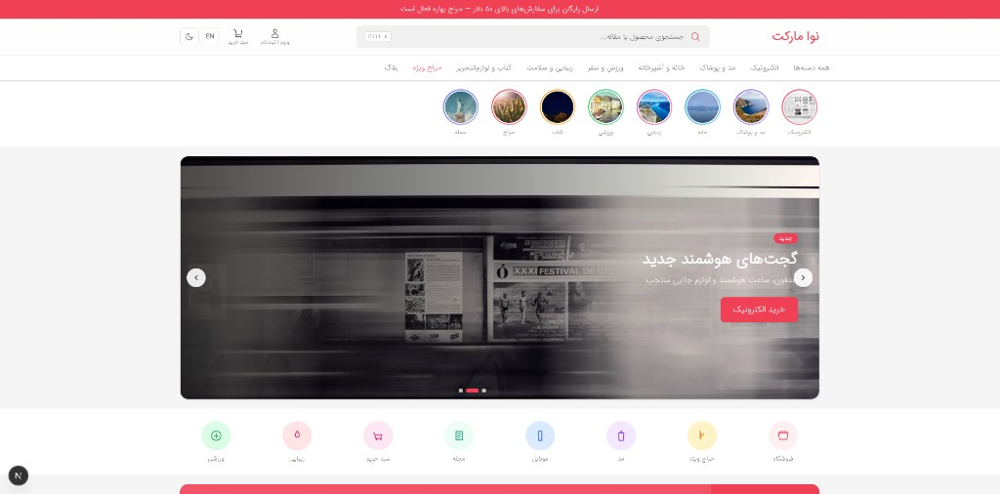
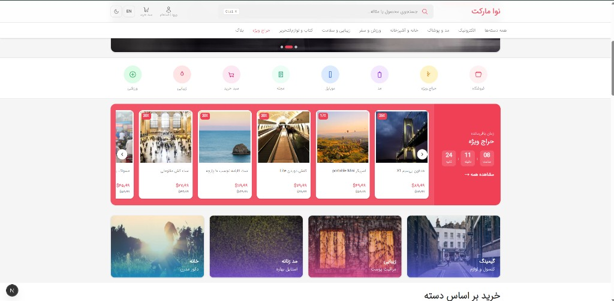
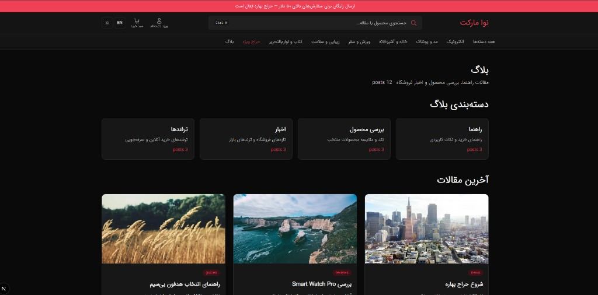

# Nova Mart — E-commerce Frontend Mockup

A bilingual (Persian / English) e-commerce storefront mockup built with **Next.js 16 App Router**. Designed as a portfolio piece — frontend only, no backend or real payments.

**Live demo:** deploy to your subdomain (see [Deploy](#deploy))

**Author:** [DevAmir](https://devamir.com)

---

## Screenshots

### Home — full page (Persian / RTL, light)

Story rail, hero carousel, special offers, promo banners, category grids, product sections, brands, and blog row.



### Home — full page (English / LTR, dark)

Same retail layout in English with dark theme — header, deals strip, product grids, and portfolio CTA.



### Home — hero & header (English, light)

Two-row header, search bar (Ctrl+K), category sub-nav, story rail, and hero slider.



### Home — deals & banners (Persian, light)

Special offers carousel with countdown, promo tile grid, and category quick links.



### Blog (Persian, dark mode)

Blog landing with category cards and latest articles.



---

## Highlights

- **Digikala-inspired home** — story rail, hero carousel, amazing deals strip, promo banners, dense product grids
- **Bilingual UI** — `/fa` (RTL) and `/en` (LTR) with dictionary-based i18n
- **Full store flow** — home, shop (PLP/PDP), blog, cart, mock checkout
- **24 mock products**, categories, blog posts, and reviews (JSON data layer)
- **Red theme** with dark/light mode (`next-themes`)
- **Search** — Ctrl+K dialog across products and blog
- **Accessible** — skip link, focus styles, reduced-motion support
- **Portfolio CTAs** — links to [devamir.com](https://devamir.com) and social profiles

## Tech Stack

| Layer | Tools |
|-------|-------|
| Framework | Next.js 16, React 19 |
| Language | TypeScript 5 |
| Styling | Tailwind CSS 4 |
| Theme | next-themes |
| Fonts | Geist + IRANSans (Persian) |
| Data | Static JSON + typed getters |

## Project Structure

```
app/[locale]/(store)/     Store pages (home, shop, blog, cart, checkout…)
components/               UI, layout, cart, shop, search, portfolio
docs/screenshots/         README preview images
lib/data/                 Types, getters, localization helpers
lib/i18n/                 Locale config + dictionaries
lib/cart/                 Cart state (localStorage)
lib/shop/                 Route resolution for catch-all shop URLs
lib/site/author.ts        Author contact & social links (single source)
data/                     products, categories, blog-posts, reviews
messages/                 fa.json, en.json
middleware.ts             Locale redirect
public/fonts/             IRANSans webfont
```

## Getting Started

```bash
npm install
npm run dev
```

Open [http://localhost:3000](http://localhost:3000) — middleware redirects to `/fa` or `/en`.

### Scripts

```bash
npm run dev      # Development server
npm run build    # Production build
npm run start    # Production server
npm run lint     # ESLint
```

## Features by Area

### Shop
- Category / subcategory / product catch-all routing
- Filters (category, price, in-stock), sort, product gallery, variants
- Related products, reviews tab, breadcrumb navigation

### Cart & Checkout
- Client cart with `localStorage` persistence
- Quantity updates, remove items, order summary
- Mock checkout form (no real submission)

### Blog
- Category pages and post detail
- Featured posts on home

### i18n
- Locale in URL: `/fa/...`, `/en/...`
- `dir="rtl"` / `dir="ltr"` on `<html>`
- All UI strings from `messages/*.json`

### Home (retail layout)
- Two-row header with search bar and category sub-nav
- Story rail, hero slider, quick-access icons
- Special offers carousel with countdown timer
- Promo banner grids (4-col, wide, 2-col)
- Circular category icons, brand strip
- Dense 6-column product grids + horizontal carousels
- Horizontal blog row, compact portfolio CTA

## Author & Contact

| | |
|---|---|
| Website | [devamir.com](https://devamir.com) |
| Email | [devamir99@gmail.com](mailto:devamir99@gmail.com) |
| Phone | [0920 500 7494](tel:+989205007494) |
| LinkedIn | [linkedin.com/in/devamir](https://www.linkedin.com/in/devamir) |
| GitHub | [github.com/devamirr](https://github.com/devamirr) |
| Telegram | [t.me/devamir99](https://t.me/devamir99) |

Author links are centralized in `lib/site/author.ts`.

## Deploy

### Vercel (recommended)

1. Push the repo to GitHub
2. Import project in [Vercel](https://vercel.com)
3. Framework preset: **Next.js** (auto-detected)
4. No environment variables required — static mock data only
5. Optional: set custom domain / subdomain (e.g. `nova.devamir.com`)

Build command: `npm run build`  
Output: Next.js default

### Manual

```bash
npm run build
npm run start
```

## Notes

- This is a **mockup** — forms, checkout, and cart do not connect to any API
- Product images use placeholders / external URLs from mock data
- Persian font: `IRANSansWeb_UltraLight.woff2` in `public/fonts/`

## License

Open source — available for learning and portfolio reference.

---

Built by **[DevAmir](https://devamir.com)**
